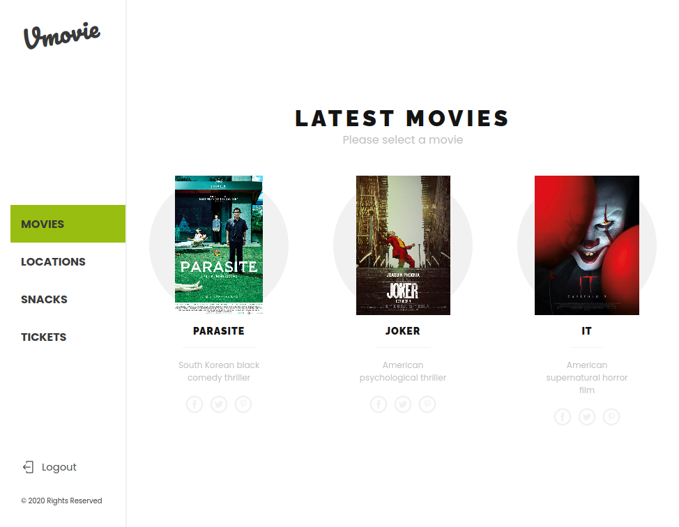

# Movie Date App

This responsive web app uses the [MovieDateApi](https://github.com/bren2102/MovieDateApi) to fetch the movies, cities and tickets per user. A user can login only with his/her user and save a ticket, then can check all the tickets saved on "tickets section".

## Preview

## Instructions

To install the project follow these instructions:

- Click on ***code*** and clone with SSH
- Go to wherever you want to store the game
- Open your terminal and type **git init** and enter
- Then type **git clone** -*paste the link copied*- and enter
- Finally open the project with your IDE (e.g: Visual Studio Code)
- Open the terminal from that project
- Run 'npm start'

## Built With

- Node.js
- React
- React-DOM
- [React-Create-App](https://github.com/facebook/create-react-app)
- Redux 
- npm
- CSS
- ES6

## Resource

- [MovieDateApi](https://github.com/bren2102/MovieDateApi)

## Live Demo

[Live Demo Version](https://bren2102-moviedate.herokuapp.com/Movies)

## Author

👤 **Brenda Yucra**

- Github: [@bren2102](https://github.com/bren2102) 
- Twitter: [@BrendaYucra2](https://twitter.com/BrendaYucra)
- Linkedin: [Brenda Yucra](https://www.linkedin.com/in/brenda-yucra/)

## Credits

- Design: [Vespa-Responsive Redesign](https://www.behance.net/gallery/26425031/Vespa-Responsive-Redesign)

## 🤝 Contributing

Contributions, issues and feature requests are welcome!

Feel free to check the [issues page](https://github.com/bren2102/MovieDate/issues).

## Show your support

Give a ⭐️ if you like this project!